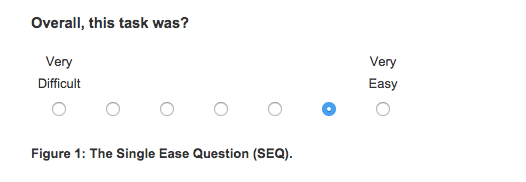

Хороший пользовательский опыт — это больше денег. Но как измерить пользовательский опыт? Как мы узнаем, становится ли он лучше или хуже?

Несмотря на субъективность и вариативность пользовательского опыта, существуют действенные способы измерения удобства использования и общего пользовательского опыта для взаимодействия с каждой частью вашего сайта и в целом.

## Зачем измерять пользовательский опыт?

> Измерение — это первый шаг к контролю и, в конечном итоге, к улучшению. Если вы не можете что-то измерить, вы не можете этого понять. Если вы не можете этого понять, вы не можете это контролировать. Если вы не можете это контролировать, вы не можете это улучшить.   
> – H. James Harrington

Есть много причин для измерения пользовательского опыта. Главный? Выявление проблемных мест и работа над их улучшением. Другие причины:

-   Выявление, количественная оценка и передача UX заинтересованным сторонам.
-   Получение четкого представления о своем позиционировании и конкурентных преимуществах.

UsabilityGeek хорошо об этом говорит: «В конечном счете, основная цель показателей юзабилити — помочь в создании системы или продукта, которые не являются ни недоработанными, ни чрезмерно спроектированными».

Для измерения UX используется множество показателей. Однако в этой статье я сосредоточусь на оценке удобства использования. В более широком смысле они подразделяются на две категории:

-   Удовлетворение на уровне задачи;
-   Удовлетворение на уровне тестирования.

## Измерения удовлетворенности на уровне задач

Оба типа показателей удовлетворенности пользователей используют короткие анкеты. При удовлетворении на уровне задачи пользователям следует сразу же давать анкету после того, как они выполнили задачу (независимо от того, достигли ли они цели).

Существует несколько типов анкет, некоторые более популярны, чем другие, но все они пытаются измерить и количественно оценить, насколько сложно или легко было выполнить определенную задачу в пользовательском тесте. Некоторые из наиболее популярных:

-   **ASQ:** Анкета после сценария (3 вопроса);
-   **NASA-TLX:** индекс загрузки задач НАСА (5 вопросов);
-   **SMEQ:** опросник субъективного умственного усилия (1 вопрос);
-   **UME:** Оценка юзабилити (1 вопрос);
-   **SEQ:** один простой вопрос (1 вопрос).

 

#### 1\. Анкета после сценария (ASQ)

Анкета после сценария включает три вопроса после задания:

ASQ широко используется, и исследования подтвердили, что он «имеет приемлемые психометрические свойства надежности, чувствительности и одновременной валидности и может с уверенностью использоваться в других подобных исследованиях юзабилити.

 

#### 2\. NASA-TLX

NASA-TLX — это «широко используемый, субъективный, многомерный инструмент оценки, который оценивает воспринимаемую рабочую нагрузку с целью оценки эффективности задачи, системы или команды или других аспектов производительности». На него также ссылались более чем 9000 исследований.

Анкета разбита на две части. Первая часть разделена на шесть подшкал, которые представлены на одной странице:

Следующая часть позволяет пользователю взвесить измерения на основе того, что, по его мнению, было более важным в задаче.

#### 3\. Анкета субъективного умственного усилия (SMEQ)

SMEQ состоит только из одной шкалы, и он измеряет умственные усилия, которые, по мнению людей, были вовлечены в выполнение определенной задачи.

Согласно Джеффу Сауро в Quantifying the User Experience, SMEQ сильно коррелирует с оценками SUS, а также временем выполнения, показателями завершения и ошибками.

SMEQ прост в администрировании и поддерживается большим количеством исследований.

#### 4\. Оценка юзабилити (UME)

Оценка величины — это стандартный метод, применяемый в психофизике для измерения суждений о сенсорных стимулах. По данным Эдинбургского университета:

> Процедура оценки величины требует, чтобы испытуемые оценивали величину физических стимулов, присваивая числовые значения, пропорциональные величине стимула, который они воспринимают. Высоконадежные суждения могут быть получены для целого ряда сенсорных модальностей, таких как яркость, громкость или тактильная стимуляция.

Точно так же этот процесс был принят для исследований удобства использования, чтобы измерить воспринимаемую сложность задач. Джефф Сауро в своей книге «Количественная оценка пользовательского опыта» пишет:

> Цель UME — получить измерение удобства использования, которое позволяет измерять соотношение, поэтому задача (или продукт) с воспринимаемой сложностью 100 воспринимается как вдвое сложнее, чем задача (или продукт) с воспринимаемой сложностью 50.

#### 5\. Единый простой вопрос (SEQ)

Наконец, есть единый простой вопрос, который часто рекомендуется для измерения удовлетворения на уровне задач из-за его простоты и корреляции с другими показателями удобства использования. Он состоит из одного вопроса после задания:

## Что делать с этими числами?

Анкеты на уровне задач предназначены для определения количественных показателей опыта выполнения задачи (возникшие проблемы или количество шагов для выполнения задачи). По словам Сауро, «показатели удовлетворенности на уровне задач сразу же помечают сложную задачу, особенно по сравнению с базой данных других задач». Это также помогает сравнить фактическую сложность задачи и процент выполнения с ожидаемой сложностью задачи. Вот что сказал по этому поводу Сауро:

> «Полезно использовать опрос, прошедший психометрическую проверку, например, единый простой вопрос (SEQ). Даже с правильными вопросами и вариантами ответов вам понадобится их сопоставить. Совет: рассмотрите возможность сравнения фактического рейтинга сложности задачи с ожидаемой оценкой сложности задачи. Вы можете спросить тех же или разных пользователей, насколько сложной, по их мнению, будет задача. Разрыв в ожиданиях и ретроспективных оценках может выявить проблемы взаимодействия».

На самом деле, цель анкет на уровне задач — улучшить их. Если вы можете со временем улучшить средний рейтинг, вы сможете количественно оценить, насколько дизайн улучшил UX. Устранение этих узких мест в удобстве использования должно, в свою очередь, улучшить конверсию (и прибыль).

### Удовлетворенность на уровне тестирования

Если удовлетворенность на уровне задачи измеряется непосредственно после завершения каждой задачи (успешно или нет), то удовлетворенность на уровне теста представляет собой формализованный вопросник, который заполняется в конце сеанса. Он измеряет общее впечатление пользователей от удобства использования и опыта.

Опять же, существует множество анкет, но я остановлюсь на двух популярных:

-   Шкала удобства использования системы (**SUS**, 10 вопросов);
-   Стандартизированная анкета для определения процентного ранга пользовательского опыта (**SUPR-Q**, 13 вопросов).

#### 1\. Шкала удобства использования системы (SUS)

SUS включает 10 позиций:

-   Я думаю, что хотел бы часто пользоваться этой системой.
-   Я нашел систему излишне сложной.
-   Я думал, что система проста в использовании.
-   Я думаю, что мне понадобится поддержка технического специалиста, чтобы использовать эту систему.
-   Я обнаружил, что различные функции в этой системе хорошо интегрированы.
-   Я думал, что в этой системе слишком много непоследовательности.
-   Я предполагаю, что большинство людей очень быстро научатся пользоваться этой системой.
-   Я нашел систему очень громоздкой в использовании.
-   Я чувствовал себя очень уверенно, используя систему.
-   Мне нужно было многому научиться, прежде чем я смогу начать работать с этой системой.

На каждом вопросе пользователям дается шкала от 1 до 5:

Как посчитать оценку SUS:

-   Для нечетных элементов вычтите единицу из ответа пользователя.
-   Для четных элементов вычтите ответы пользователя из пяти.
-   Это масштабирует все значения от 0 до 4 (4 — самый положительный ответ).
-   Сложите преобразованные ответы для каждого пользователя и умножьте полученное количество на 2,5. Это преобразует диапазон возможных значений от 0 до 100 вместо от 0 до 40.

#### 2\. SUPR-Q

SUPR-Q пытается определить, является ли веб-сайт удобным, надежным и визуально привлекательным. В нем 8 вопросов (включая 1 вопрос NPS). Вопросы о доверии различаются в зависимости от того, ориентирован ли сайт на коммерцию. Вот они:

-   Сайт прост в использовании. (юзабилити)
-   На веб-сайте легко перемещаться. (юзабилити)
-   Мне комфортно делать покупки на сайте. (доверие для коммерческих сайтов)
-   Я уверенно веду бизнес на сайте. (доверие для коммерческих сайтов)
-   Информация на сайте достоверная. (доверие для некоммерческих организаций)
-   Информация на сайте вызывает доверие. (доверие для некоммерческих организаций)
-   Насколько вероятно, что вы порекомендуете этот сайт другу или коллеге? (верность)
-   Скорее всего, я вернусь на сайт в будущем. (верность)
-   Я считаю сайт привлекательным. (внешность)
-   Веб-сайт имеет чистое и простое оформление. (внешность)

Опять же, они оцениваются по шкале от 1 до 5:

Что касается оценки, сложите ответы на первые 12 вопросов. К этой сумме — половина балла за вопрос о NPS. Наименьшая возможная оценка — 12, максимальная — 65. Затем вы можете сравнить свою оценку с отраслевыми эталонами.

### Net Promoter Score (NPS)

NPS не входит в ту же категорию, что и другие анкеты, но я хотел добавить его, потому что это популярный и эффективный метод измерения пользовательского опыта и удовлетворенности (и это один из вопросов в SUPR-Q). Скорее всего, вы уже все слышали о Net Promoter Score (NPS). NPS рассчитывается, задав один вопрос:

> «Насколько вероятно, что вы порекомендуете (продукт или услугу) другу?»

Затем вы разбиваете ответы на три части:

-   **Промоутеры (9–10)**. Это ваши самые счастливые и самые лояльные клиенты, которые, скорее всего, порекомендуют вас другим. Используйте их для отзывов, партнеров и т. д.
-   **Пассивные (7–8)**. Эти клиенты счастливы, но вряд ли порекомендуют вас друзьям. Конкурент может их довольно легко переубедить.
-   **Недоброжелатели (0–6)**. Недоброжелатели — это клиенты, которые недовольны и могут быть опасны для вашего бренда, распространяя негативные сообщения и отзывы. Выясните их проблемы и исправьте их.

Просто вычтите процент недоброжелателей из процента промоутеров, чтобы получить свой NPS. Эта оценка не для того, чтобы сравнивать вас с конкурентами. Это — ориентир для отслеживания ваших успехов.

Таким образом, NPS очень похож на ваш коэффициент конверсии — хороший NPS лучше, чем тот, который у вас был в прошлом месяце. Хотя NPS довольно популярен, есть скептики. Вот что об этом говорит Крейг Моррисон из Usability Hour:

> «Говоря о Net Promoter Score, вы часто слышите, как люди говорят, что он неточный, не работает, или что это зависит от того, как вы формулируете вопрос и т.д.

> Но дело в том, что вы делаете прямо сейчас, чтобы отслеживать, как пользователи воспринимают ваш продукт? Что-нибудь? Опросы? Интервью?

> Многие стартапы, с которыми я работаю, абсолютно ничего не делают. Так что, хотя у этой системы могут быть свои недостатки, это лучше, чем вообще ничего не делать. Это лучший способ отслеживать, насколько изменения, которые вы вносите в свой продукт, влияют на взаимодействие с пользователем».

#### Что вы делаете с этими числами?

Опять же, как и в случае с числами на уровне задач, цель с числами удобства использования на уровне теста — улучшить результат. Однако также полезно сравнивать свои показатели с показателями конкурентов, чтобы получить реалистичное представление о том, на каком уровне находится ваш уровень удовлетворенности клиентов. Вот как выразился Сауро:

> «Что пользователи думают об удобстве использования приложения в целом? Шкала удобства использования системы (SUS) — это популярная бесплатная и короткая анкета по удобству использования (10 пунктов). Она дает общую оценку удобства использования. **Совет:** возьмите свой исходный показатель SUS и преобразуйте его в процентный рейтинг по сравнению с 500 другими продуктами или несколькими отраслевыми эталонами».

Вы можете сравнить свой NPS с показателями в вашей отрасли, но, как отмечалось ранее, ценность ограничена. NPS, если использовать его с умом, может принести гораздо больше преимуществ, чем сравнительный анализ.

Например, посмотрите эти данные RJMetrics. Ваши лучшие клиенты тратят на вас больше всего денег: диаграмма, показывающая пожизненную ценность клиента относительно чистой оценки промоутера.

Вы можете предположить, что ваши промоутеры — ваши лучшие клиенты или, по крайней мере, сильно коррелируют с теми, кто тратит больше. Следовательно, знание ваших «промоутеров», тех, кто любит ваш бренд, может быть полезным при планировании рекламных акций и кампаний с таргетингом. Как сказал Questback, «помогите своим промоутерам сказать всем, что они вас ♥».

Точно так же вы можете откопать множество проблем с пользовательским интерфейсом от недоброжелателей. Какие проблемы продолжают появляться? Есть какие-то тенденции? Некоторые говорят, что следует игнорировать пассивных; другие говорят, что нет. Часто вы можете рассматривать их как растущий сегмент и решать, как превратить их в промоутеров.

**Итак, для NPS:**

-   Измеряйте свой результат с течением времени.
-   Измеряйте индивидуальные тенденции с течением времени. Изучите тенденции, которые улучшаются или ухудшаются.
-   Помогите промоутерам рассказать о вас миру. (Кроме того, помогите им купить больше вещей.)
-   Найдите идеи через недоброжелателей. Позвольте им научить вас тому, что вы можете улучшить в своем пользовательском опыте.

Однако небольшое примечание относительно этих показателей: согласно NN / g, «пользователи обычно предпочитают дизайн, который быстр и прост в использовании, но удовлетворенность не на 100% коррелирует с объективными показателями удобства использования». Фактически, они обнаружили, что пользователи предпочитают дизайн с наивысшими показателями удобства использования только в 70% случаев.

Хотя они обнаружили в данных лишь слабые парадоксы, важно учитывать показатели производительности и предпочтений (например, указанные выше). Анкеты по удобству использования — это инструмент в стремлении оптимизировать ваш UX для получения дохода и пожизненной ценности клиента. Не прекращайте A / B-тестирование в ближайшее время :)

### Заключение

Нет единого лучшего способа измерить UX вашего сайта. Как резюмирует Сауро, «не существует термометра юзабилити, который показывал бы, насколько пригодно ваше программное обеспечение или веб-сайт».

Поэтому используйте несколько показателей измерения удобства использования и взаимодействия с пользователем. В этой статье представлены только показатели удовлетворенности; при этом не учитывались другие важные показатели, такие как процент выполнения, ошибки, время выполнения задачи и важнейший коэффициент конверсии.

Тем не менее, показатели удовлетворенности на уровне задач и на уровне тестирования могут дать вам хороший индикатор удовлетворенности пользователей, по крайней мере, в качестве ориентира для оптимизации. Вам не обязательно использовать все вышеперечисленные анкеты (очевидно). Выберите по одному из каждой категории и начните измерения.

---

[_Original article_](https://cxl.com/blog/8-ways-to-measure-ux-satisfaction/) _by:_ [_Alex Birkett_](https://cxl.com/blog/author/alexbirkett-2/ "Posts by Alex Birkett")
