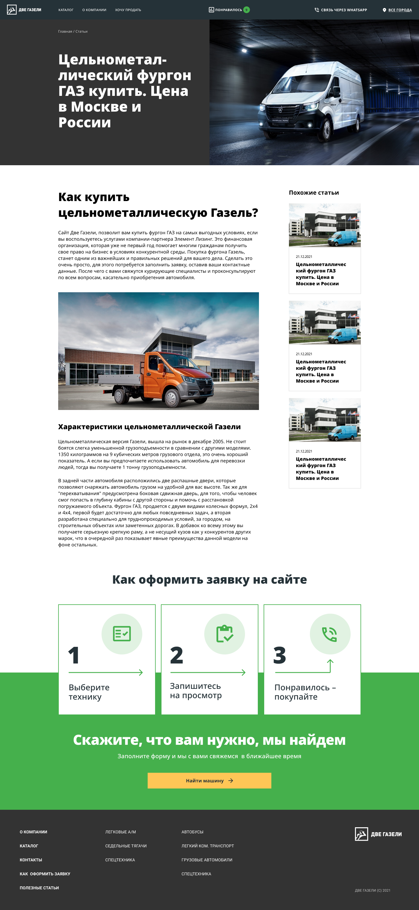

2 ГАЗели - онлайн-сервис покупки и продажи коммерческой техники: легкий коммерческий транспорт, грузовые автомобили, спецтехника и также соответствующее оборудование. Вся техника, продаваемая на сайте, реализуется в 70 регионах России и без участия перекупщиков.

 

## Часть 1\. Аудитория

Основной парк автомобилей компании – различные модификации ГАЗели, исходя из этого (и интервью со стейкхолдерами) мы можем сделать вывод о целевой аудитории, как о небольших транспортных предприятиях, в которых зачастую DMU является владельцем бизнеса и располагает ограниченным бюджетом, он знает зачем пришел, и готов приобретать транспорт вне своего региона, если предложение будет подходящим и прозрачным. Соответсвенно, каналами привлечения аудитории будут органика, таргет и ремаркетинг.

 

## Часть 2\. Прототип

Изучив подробно как маркетплейсы, так и монобрендовые сайты по продаже б/у спецтехники и автомобилей, проработали возможные сценарии поиска пользователем необходимого предложения.

На основе этой работы был разработан Mid-Fi прототип, в основу которого легла гипотеза, что пользователь приходит либо за конкретным автомобилем, либо за определенной категорией (напр. «легкий коммерческий транспорт»), а наша задача – заполнение им формы обратной связи. Соответственно, первый экран сразу предлагает выбрать категорию/бренд, а ниже мы отрабатываем возникающие вопросы: как оформить заявку, почему стоит заказывать тут и т.д.

 

 

### Получив предварительное одобрение концепта, разрабатываем прототипы всех экранов.

 

#### Страница категорий

На данной странице отображаем все доступные категории, блок спецпредложений и алгоритм оформления заявки. 
В карточке категории обозначаем количество предложений и начальную цену. 

 

#### О компании

Страницы о компании включают в себя не только контакты и описание компании, но также
и основные бенефиты, и алгоритм оформления заявки. А учитывая обширную географию компании, 
на странице контактов реализован фильтр по регионам.

 

## Часть 3\. Дизайн

Некоторые элементы брендинга (логотип, фирменные цвета) были предоставлены клиентом. 
На их основе были разработаны все основные элементы интерфейса, с использованием библиотеки Material Design.

Обработав обратную связь от владельцев бизнеса по прототипу, 
было принято решение убрать с главной страницы информацию 
о компании и процессах, и добавить основной фильтр на первый экран. 
Также было пересмотрено основное меню в топбаре и футер.

 

## Часть 4\. Прочие страницы

Кроме коммерческих страниц, также были разработаны страницы контактов, о компании и 
раздел статей для SEO.

 

Несмотря на то, что страницы статей де-факто технические, 
и внедряются скорее для поисковиков, чем для реальных людей – они были сверстаны с учетом
удобства пользователя.

 

## Часть 5\. Формы

Ориентируясь, в первую очередь, на главную задачу сайта – получение лидов, были разработаны 
три типа форм: покупка из карточки, заявка на покупку без выбора на сайте, форма для продажи.

 

## Часть 6\. Подготовка в продакшен

Были разработаны адаптивные экраны для всех страниц сайта, 
а также подготовлены компоненты (UI-kit), паттерны и описание стилей.

* * *

Совместно с [Playhard Agency](http://playhard.agency/)