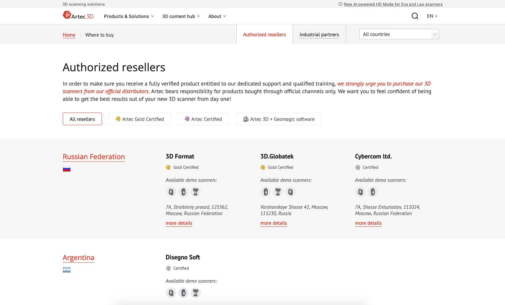
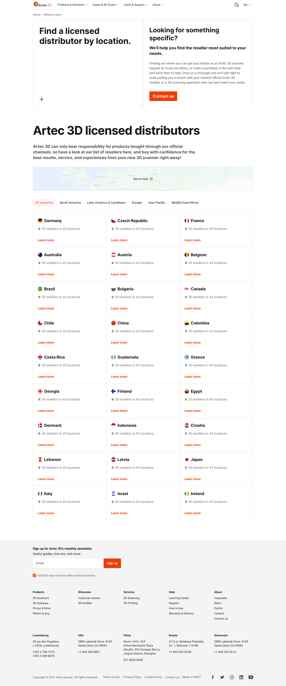
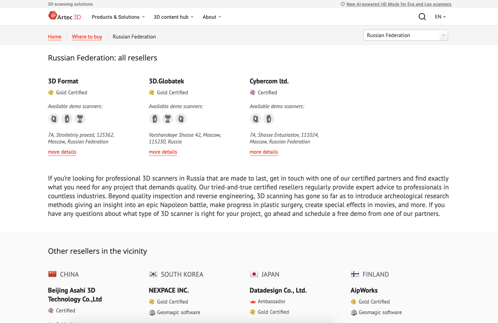
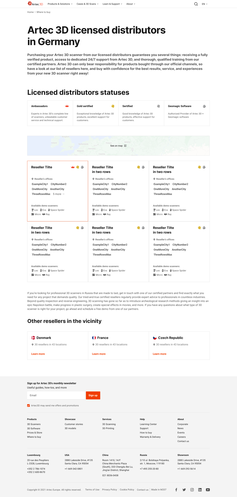
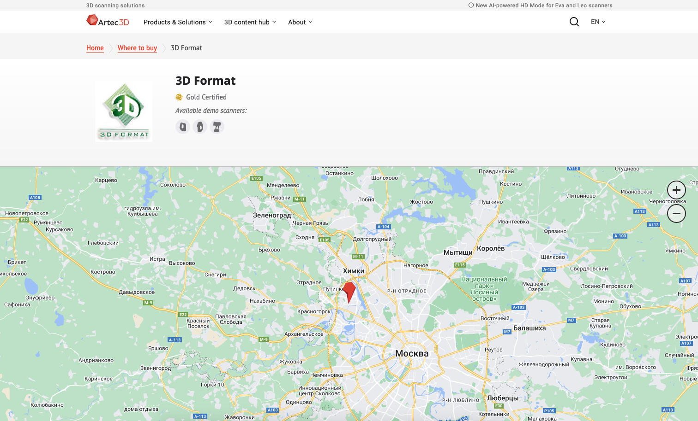
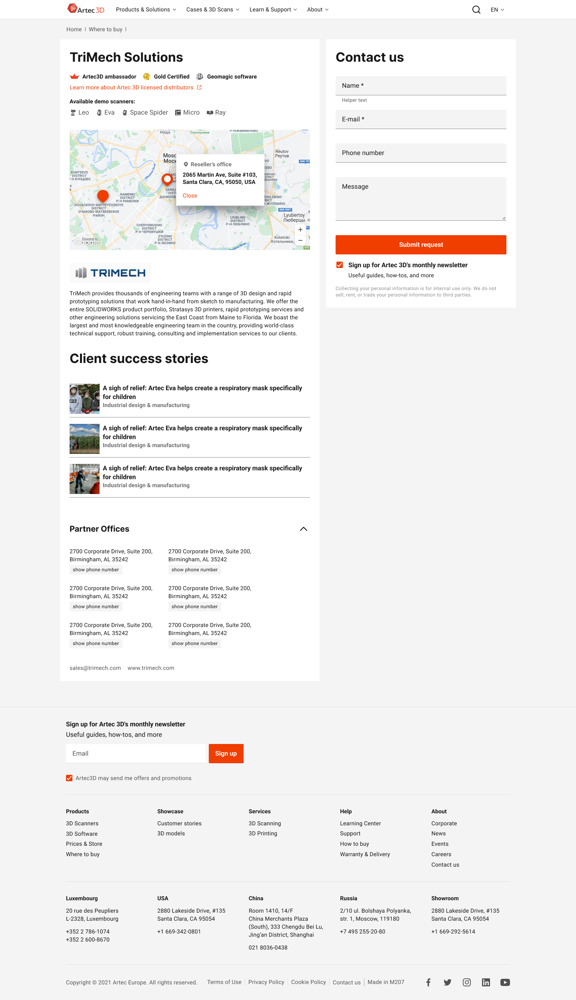

Artec 3D — мировой лидер в производстве ручных и портативных 3D-сканеров, который с 2007 года 
находится в авангарде разработки инновационных 3D-технологий.

 

## Часть 1\. Роль реселлеров в лидогенерации

Компания реализует оборудование и софт через международную сеть независимых реселлеров. 
Масштаб реселлеров отличаются: это может быть как крупная сеть из сотен офисов по всему 
миру с собственным маркетингом и репутацией, так и небольшой офис на два сотрудника где-то 
на европейской периферии.

Проведя исследования: внутренние (интервью с сейлз-директором, руководителем клиентской 
поддержки, маркетингом) и интервью непосредственно с реселлерами, мы пришли к выводам:

1. Выбор реселлера чаще всего происходит либо по географическому признаку, 
либо по наличию демо-оборудования.
2. Фактически, передача лида реселлеру происходит через сейлз-менеджера, 
то есть в не зависимости от того, как лид пришел, что выбрал и какой СТА нажал – 
решение о выборе реселлера остается за сейлз-менеджером (это внутренний процесс, 
который не должен транслироваться)
3. Реселлеры получают статусы от компании, проходя тренинги и “сертификацию”, 
но эти статусы не понятны клиенту, и на первый взгляд, являются лишь показателем 
отношений между компанией и партнером.
4. Статусы реселлеров не статичны. Партнер может как получить статус, так и лишиться его в любой момент. 
5. В текущем дизайне непонятен масштаб реселлера, что порой является важным 
фактором принятия решения для клиента.

 

Как выглядела страница до начала работ:

 

## Часть 2\. Упрощаем путь пользователя

Большая часть пользователей приходит на страницу либо с главной, 
либо с продуктовых страниц, и учитывая тёплый запрос, нам необходимо 
сразу предоставить самый простой ответ, которым, учитывая все факторы, 
является прямой призыв к действию:

 

## Часть 3\. Самостоятельный поиск

Далее мы предполагаем, что поиск происходит по следующему алгоритму: 
регион -> страна -> город -> наличие демо-оборудования -> фактический адрес

 

#### 3\.1 География и демо-оборудование

Эти факторы созависимы, так как география важна не только в личном взаимодействии, 
но и в возможности тестирования оборудования, а также технической и тренинг-поддержки. 
Упростить поиск реселлера стало возможным благодаря внедрению фильтров и виджета 
карты на станице. И из карточки страны становится понятен масштаб присутствия 
компании в стране/регионе, что вкупе с СТА на первом экране, должно снизить 
вероятность возможных фрустраций.

 

#### 3\.2 Статус реселлера

Кроме географии и наличия демо-оборудования, реселлеры обладают некоторыми 
статусами, которые указывают на компетенции или возможность приобрести 
дополнительное ПО. Этот момент был неочевиден для пользователя, так как 
информация была доступна только в десктопной версии по ховеру иконки. 
Было принято решение внедрить статичный блок с описанием преимуществ, 
обладающих статусом реселлеров, на странице страны.

 

#### 3\.3 Список реселлеров с стране

Многие реселлеры обладают несколькими офисами в разных городах (а иногда и 
регионах, что актуально для США). Этот момент был неочевиден, до тех пор, 
пока пользователь не попадет непосредственно на страницу реселлера.

Поэтому, в списке реселлеров, мы указываем 
города присутствия, а в случае США – штаты. Это сделано для того, чтобы 
пользователю было проще определиться с реселлером уже на станице страны.

 

#### 3\.4 Страница реселлера и обратная связь

В прошлой версии весь первый экран занимала карта, которая вполне могла 
не загружаться, из-за качества интернета, настроек браузера или сети. 

В новой версии решено было на первом же экране показывать форму (которая 
де-факто отправляет запрос в сейлз), карта же была уменьшена в размере 
и переработана. Также добавлены истории успеха (кейсы) с использованием 
оборудования или софта компании, и контакты (по запросу “спрятанные” в аккордеон).

 

## Часть 4\. База данных

В старой версии все изменения вносились вручную через ЛК CMS, что 
усложняло коммуникацию, поддержку актуальности данных и их единобразие. 
В новой версии было предложено использовать общую для всех вовлеченных 
сотрудников (сейлз, маркетинг, дизайн, администрирование сайта и разработка) 
базу данных (Google Sheets), которую легко актуализировать и поддерживать.

 

## Часть 5\. Вывод 

По итогу удалось сократить путь пользователя до одного клика до формы 
обратной связи. Сделать более простым и понятным самостоятельный поиск 
реселлера: за счет обновленного каталога, фильтров и наглядного описания 
статусов. А общая база данных решила проблему актуализации и единообразия представления данных.