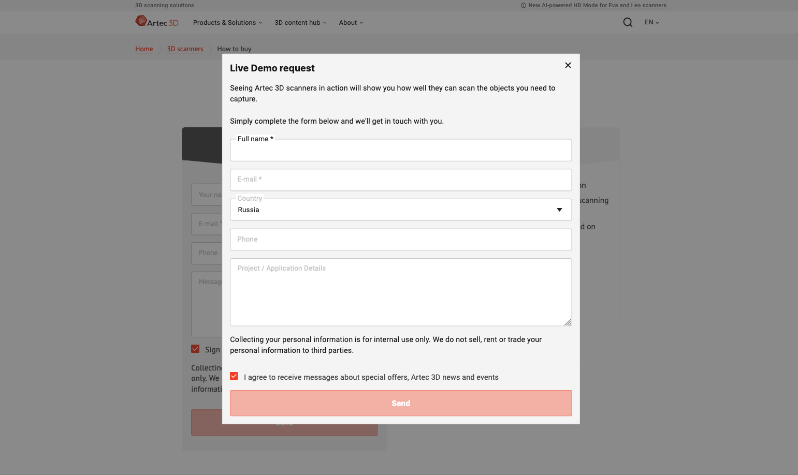
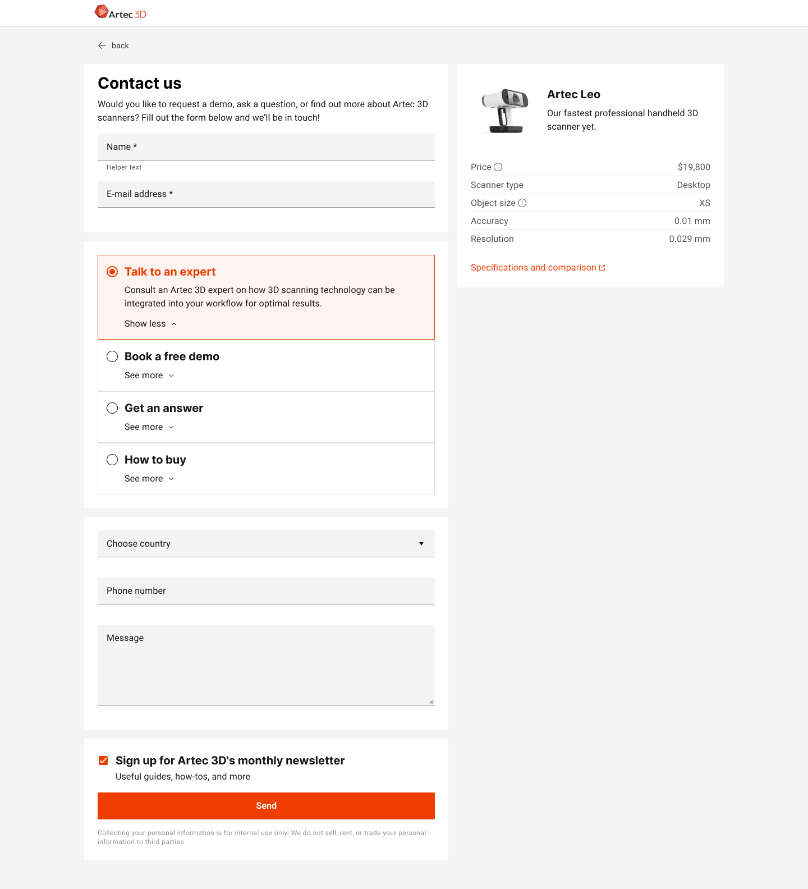
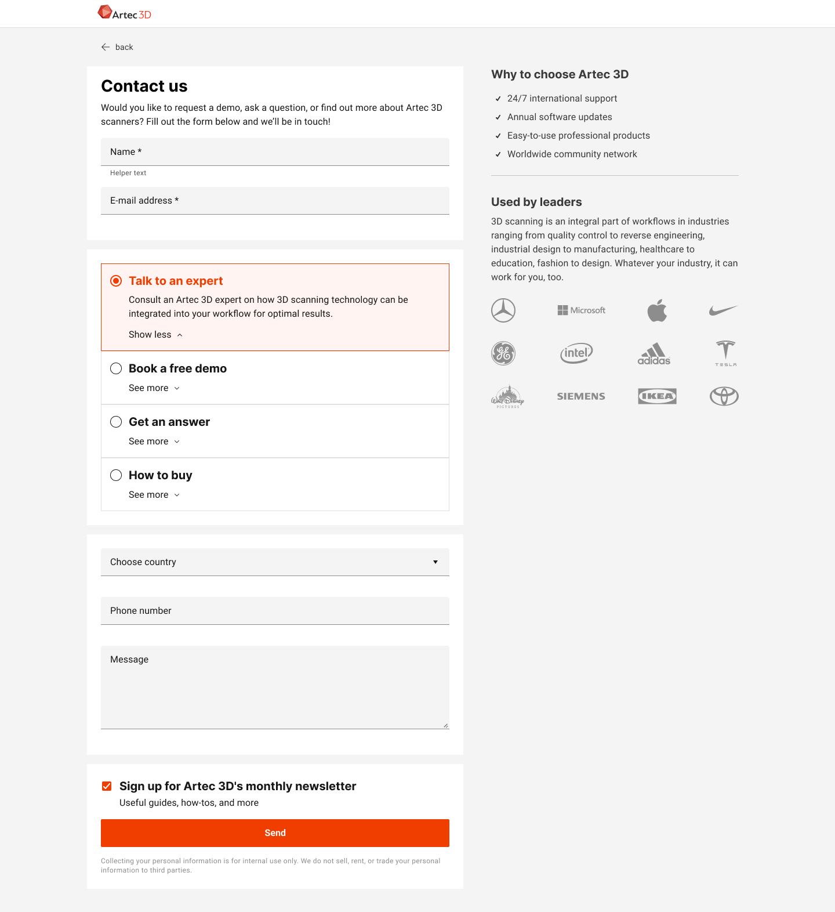
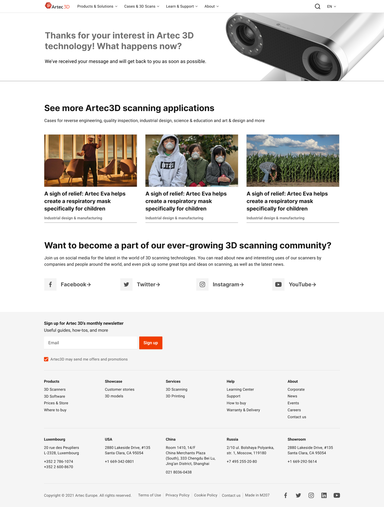

*Artec 3D — мировой лидер в производстве ручных и портативных 3D-сканеров, который с 2007 года 
находится в авангарде разработки инновационных 3D-технологий.*

 

## Часть 1\. Проблема

Зачастую, форма отбратной связи воспринимается маркетологами, дизайнерами и разработчиками как
уже принятое пользователем решение, к которому его нужно просто "подтолкнуть" в нужный момент.
Из этого заблуждения следует несистемный подход к разработке форм и, предоставление
пользователю исключительно "обязательств" по заполнению, без заботы о его интересах, где также игнорируются
возможности дополнительной коммуникации с целью снизить количество отказов и донести важные
для принятия решения тезисы.

Подобный подход мы могли наблюдать и тут: чуть ли не каждый СТА имел свой вид формы (7 типов на сайте), 
формы были реализованы независимо друг от друга, какие-то открывались в модальном окне, какие-то
на отдельной странице, что приводило например к подобному результату:

 

## Часть 2\. Категоризируем типы форм

Проанализировав все представленые на сайте варианты обратной связи, приходим к выводу, что 
существует три типа СТА, за которыми следует форма:
- Коммерческие (How to buy, Buy now)
- Запрос демо (Request a demo)
- Поддержка (Talk to an expert, Get an answer, Contact Us)

Также можно выделить две категории запросов:
- Продуктовый (со страниц сканеров или софта)
- Общий (с прочих страниц) 

 

## Часть 3\. Дополнительная коммуникация

Так как запрос попадает напрямую в сейлз и поддержку – логично провести интервью
с руководителями этих департаментов, чтобы выявить возможные вопросы, поступающие
от лидов, и информацию, которая может способствовать заполнению формы.

Из этих источников мы узнаем, что заполнившие форму часто не знают о важных преимуществах,
предоставляемых клиентам компании: круглосуточная поддержка пользователей продуктов,
регулярно обновляемое ПО, доступ к международному профессиональному комьюнити. 
А порой, пользователь может не знать о дополнительных возможностях, как например: онлайн- и оффлайн-демо.
В итоге, эти важные бенефиты решено было отобразить в форме, так как они более нигде не транслируются.

 

## Часть 4\. Дизайн формы обратной связи

Проанализировав состав текущих форм, понимаем что по сути есть три блока:
- Имя и почта (единственный обязательный к заполнению блок)
- Тип запроса (зависит от СТА)
- Дополнительная информация (страна, телефон, сообщение)

В первую очередь сокращаем количество форм до двух типов, по типу запроса (продуктовый, общий), 
а зависимость от СТА мы преобразуем в преимущество, с помощью которого можем донести
пользователю необходимую нам (и ему) информацию, как например возможность онлайн-демо.

Также вводим новый блок, который в зависимости о типа формы будет предоставлять 
потенциальному клиенту необходимую информацию: либо о продукте, либо о компании в целом.

В продуктовой форме мы выводим сводную информацию о выбранном продукте, а с общих страниц –
бенефиты для клиентов компании и блок с логотипами известных клиентов, как дополнительный social proof.

 

В дополнение обновлен дизайн страницы Thank-you-page, куда были добавлены ссылки на кейсы и социальные сети.

 

## Часть 5\. Вывод

В итоге удалось привести обратную связь с потенциальными клиентами к единобразию, с учетом
заботы о пользователе, донести необходимую информацию вне зависимости от типа запроса, 
а также транслировать важные бенефиты, предоставляемые клиентам компании.
