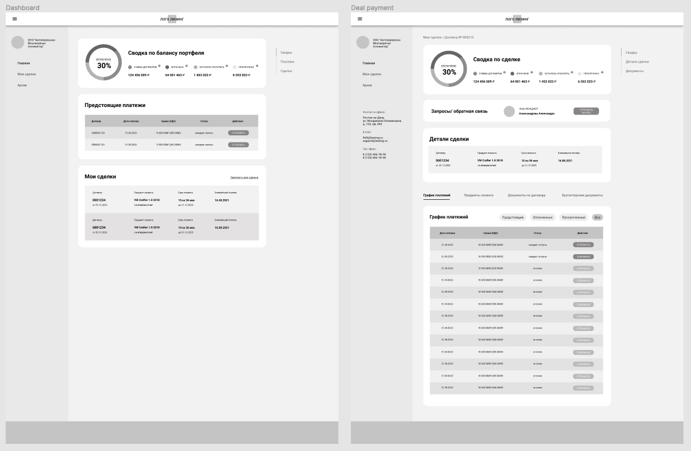
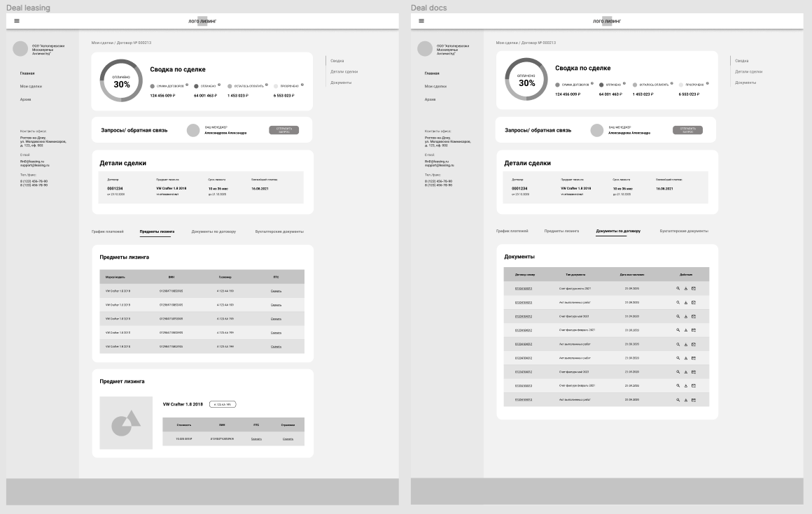
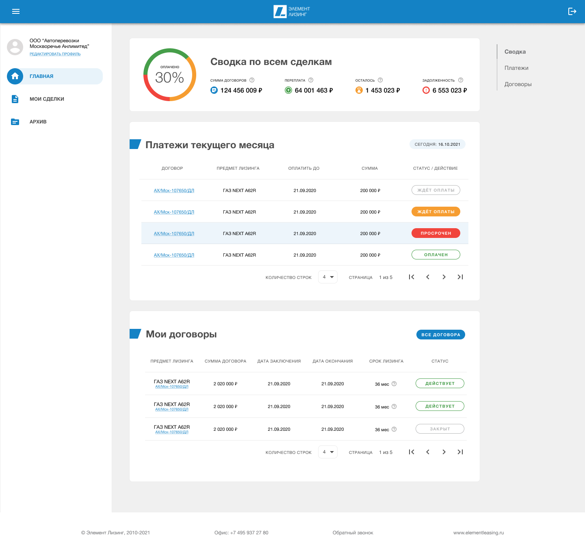
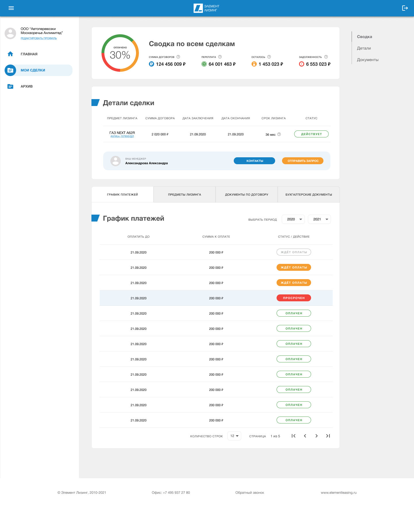
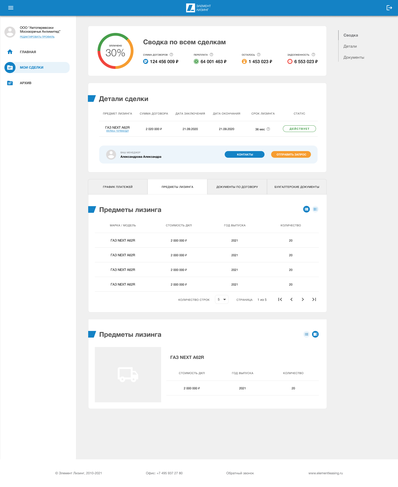
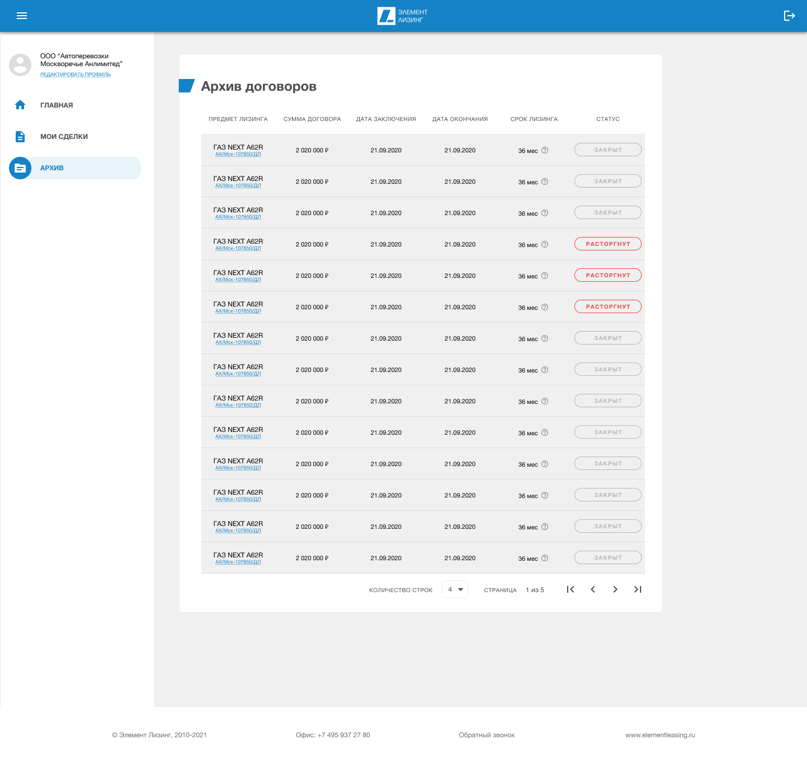

Компания входит в ТОП-30 лизинговых компаний России, занимает 12-е место по количеству 
заключенных сделок, 10-е место по объему нового бизнеса в сегменте грузового 
автотранспорта, 6-е место в сегменте автобусов и троллейбусов, 5-е место в сегменте 
медицинского и фармацевтического оборудования; 15-е место в сегменте малого бизнеса,
 7-е место – по объему нового бизнеса в сегменте физических лиц и 1-е место по 
 финансированию коммерческих автомобилей марки ГАЗ. 

 

## Часть 1\. Задача

Необходимо в короткие сроки разработать первую версию личного кабинета клиента 
с интеграцией CRM. Но на данном этапе не было понимания насколько масштабным должны 
быть задачи решаемые пользователем через ЛК, какие данные будут интегрированы позже, 
и роли менеджеров в этом процессе.

 

## Часть 2\. Прототип

Проанализировав имеющуюся информацию, приступили к разработке прототипа. 
За основу сразу было принято решение брать Material Design (на тот момент 2.0), 
чтобы сократить время и бюджет на разработку первых прототипов, а также учесть 
неопределенность в дальнейшем развитии продукта.

 

## Часть 3\. Дизайн

После нескольких консультаций со стейкхолдерами, аккаунт-менеджерами и 
руководством компании, были подготовлены первые экраны личного кабинета 
клиента. В них реализованы, как интеграция с CRM компании, так и дополнительный 
функционал для пользователя: возможности оплаты, выставление счетов, архив 
документов и сделок, а также дашборд с общей информацией о финансовых операциях и их статусе.

 

## Часть 4\. WIP

На данный момент продукт функционирует, проходит необходимые тесты и сбор 
обратной связи. В планах добавление функционала, дополнительных данных и 
возможностей для клиентов.

* * *

Совместно с [Playhard Agency](http://playhard.agency/)