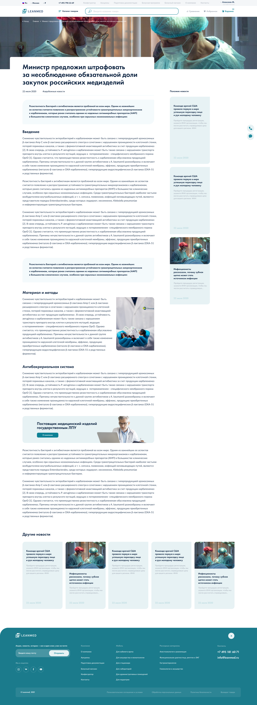

Компания «Бережливая М (Leanmed)» поставляет медицинские изделия государственным 
учреждениям здравоохранения. Основная миссия компании: создание технологичного и 
прозрачного сервиса, который облегчает выбор медицинских изделий и автоматизирует процесс закупки.

 

## Часть 1\. Пользователи

Несмотря на то, что компания предоставляет В2В/B2G сервис, мы понимаем, что за 
каждой закупкой оборудования стоит обычный человек, а значит мы не можем 
рассчитывать, что у него будет время и желание разбираться в новых для себя 
интерфейсах и паттернах. Опираясь на миссию компании, было предложено 
разработать привычный и понятный интерфейс для любого уровня пользователей, 
и соотвествующие бизнес-процессы также оформить в прозрачные алгоритмы.

Ресурс на исследования в данном проекте отсутствовал, но дедуктивно мы можем 
понять, что существует несколько фундаментальных сценариев поведения пользователя:
1. Поиск оборудования по категориям для замены/обновления
2. Поиск оборудования для типового кабинета, в соответсвии с требованием Минздрава
3. Поиск известного/заданного оборудования/расходников/бренда
4. Создание кабинета «под ключ»

Из интервью с владельцами бизнеса стало понятно, что целевой 
сегмент это – оборудование для типовых кабинетов, в соответствии с требованиями 
Минздрава, но возможность заказа отдельных юнитов тоже должна быть реализована.

 

## Часть 2\. Информационная архитектура

И-коммерс всегда подразумевает большое количество товаров, категорий, типов 
и прочей сегментации, поэтому важно выделить главные и относительно них строить 
ИА всего продукта. Также необходимо предусмотреть возможность масштабирования
 ассортимента в обе стороны.

В данном случае основная сегментация происходит по типу кабинета. Соответственно, 
к сегментации по категории продукта, мы вводим обобщающую категорию типа кабинета.

 

## Часть 3\. Конфигуратор

Состав типовых кабинетов подготовлен в соответсвии с постановлением Минздрава, 
что позволяет пользователю быть уверенным в том, что все необходимое оборудование 
можно добавить в заказ практически в один клик и оно будет соответствовать 
требованиям проверяющих органов.

В шаблон состава можно вносить корректировки, или заказать неполный состав, 
но несоответствие требованиям Минздрава будет дополнительно обозначено в поле СТА.

 

## Часть 4\. Карточка товара

Требовалось подготовить страницы для двух типов товара: обычный и премиум. 
Разница в том, что премиум-товар, в дополнении к обычной карточке-описанию, 
должен иметь «продающую» страницу.

Для обоих типов страниц были подготовлены шаблоны с разными типами блоков и 
возможностями кастомизации и масштабирования.

 

## Часть 5\. Дизайн

Профессиональный интерфейс подразумевает длительное взаимодействие и 
подробное изучение информации, экраны необходимо не перегружать графикой, 
цветом и предоставить пользователям чистый, понятный и релевантный 
профессии дизайн с явными акцентами.

 

## Часть 6\. Оформление заказа

В оформлении заказа реализуем понятный и привычный для и-кома паттерн в несколько, 
разбитых на категории, этапов.

 

## Часть 7\. Прочие страницы и продакшен

Также были подготовлены типовые страницы новостей, о компании и проч. 
Разработаны адаптивные экраны для всех страниц сайта, а также подготовлены 
компоненты (UI-kit), паттерны и описание стилей.

