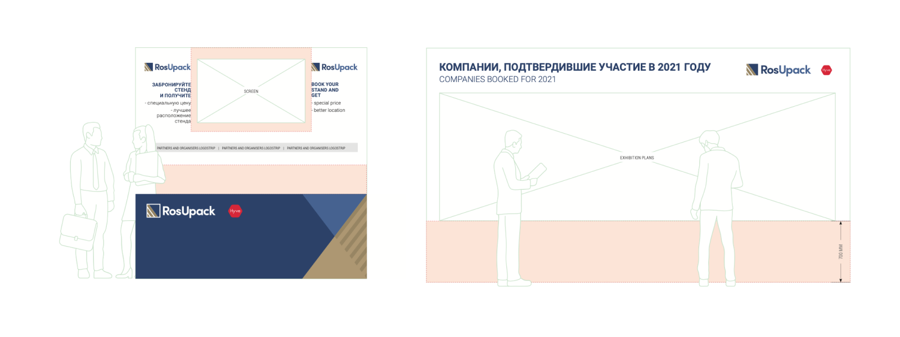

Компания Hyve Group имеет в своем портфолио множество отраслевых выставок по всему миру. 
Одна из крупнейших, не только в России, но и во всем мире – 
международная выставка упаковочной индустрии RosUpack, ежегодно проходящая в Крокус Экспо.

 

## Часть 1\. Задачи проекта

Гланвной задачей проекта было провести "обновление" стиля, который был разработам достаточно давно 
и не отражал позиционирование выставки, ее преимущества, был не гибким и в целом – устаревшим.
В результате исследования текущих маркетинговых материалов, графики и стиля, 
был предложен полный пересмотр брендинга, графики и подхода к масштабированию, с учетом
технических требований площадки, автоматизации некоторых процессов и формализации подходов.

 

## Часть 2\. Логотип

Предыдущую версию логотипа команда выставки между собой называла "мавзолейчиком", 
это конечно очень мило, но негативную ассоциацию необходимо было менять. 
Как и ассоциацию с "коробками", ведь упаковка – отрасль, представляющая самых 
разнообразных производителей и продукцию: гофрокартон, транспортную упаковку, 
производственные линии, полиграфические материалы и оборудование, дизайнерские решения и многое другое.

 

## Часть 3\. Графика
‍
Так как масштабировать знак и сопутствующий ему стиль необходимо на широкий 
спектр носителей и материалов: от полиграфии до оформления выставочных пространств 
и навигации в Крокус Экспо, сохраняя при этом tone-of-voice, соответсвующий 
бизнес-мероприятию – графика должна быть простой, сдержанной и гибкой.

 

## Часть 4\. Графика

По причине того, что стиль был разработан к началу выставки, а все продажи и 
соответсвующая коммуникация были еще со старой графикой, командой маркетинга 
было принято решение готовить материалы к грядущей выставке с новой графикой, 
но старым логотипом. Все последущие материалы были полностью обновлены.

<iframe width="100%" height="315" src="https://www.youtube.com/embed/VkzYd1cXbK8" title="RosUpack" frameborder="0" allow="accelerometer; autoplay; clipboard-write; encrypted-media; gyroscope; picture-in-picture" allowfullscreen></iframe>

 
 

## Часть 5\. PART Award

В рамках выставки RosUpack проходит ежегодная международная премия 
в области производства и дизайна упаковки – PART Award. Разработана айдентика для Премии,
стенд с витринами, где посетители могут ознакомиться работами участников, 
интерфейс экрана с описанием работ и профилями участников и прочие материалы.

